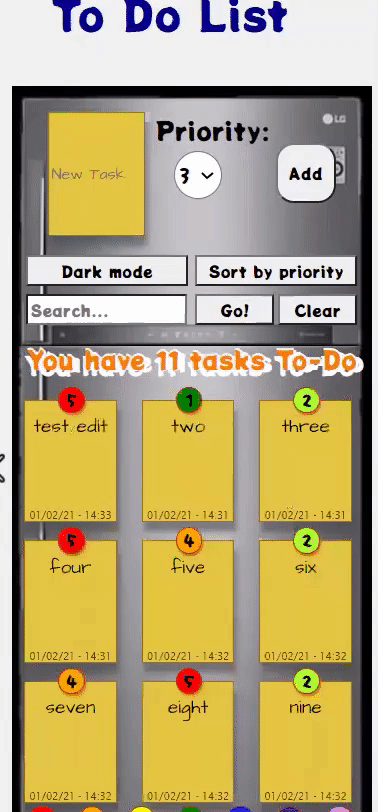
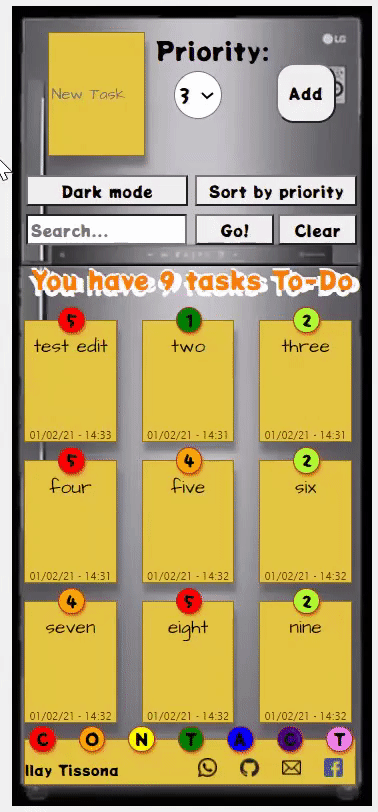
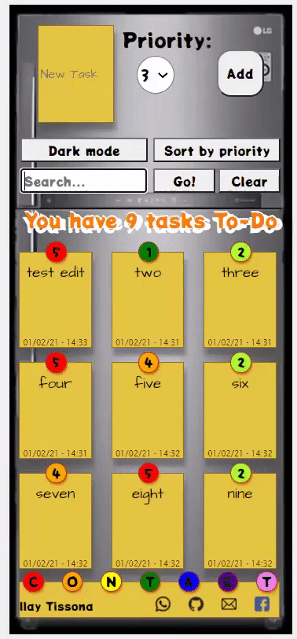
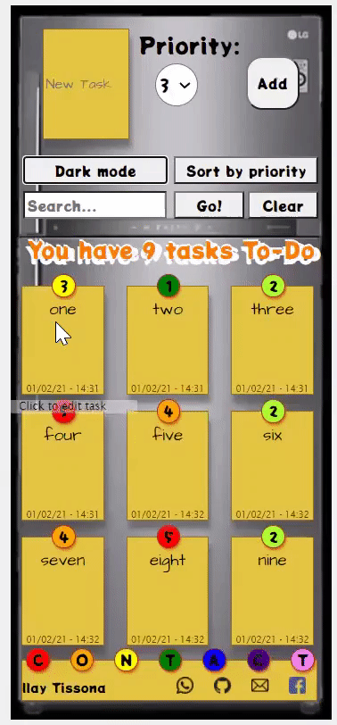

#  Pre Course Project - Todo List 📋

This is the final project for the first month of Cyber4s course.
I made a todo list web app.
It is available here: https://ilaytissona.github.io/Cyber4s-pre-course-final/src

## Cool features

- Click sort button to sort by your choice
- 
- Click dark mode button to toggle dark mode
- 
- Type your key word, and click search to highlight all notes including key word
- 
- Click on task text to edit
- 
- If the task is too long, no problem
- 
- If the list is too long, also not a problem. Arrows appear on fridge's sides, to move from page to page
- 

## Who am I?

Ilay Tissona
22 years old
Live in Moshav Dekel - Eshkol Regional council.

## Resources

- [JsonBin.com](https://jsonbin.io/) - DataBase server.
- [CSS tricks.com](https://css-tricks.com/) - Very helpful site for CSS styling.
- [MDN.org](https://developer.mozilla.org/en-US/docs/Learn/JavaScript/Objects/JSON) - Working with JSON.
- [MDN.org](https://developer.mozilla.org/en-US/docs/Web/API/Fetch_API) - Guide on fetch options.
- [DEV.to](https://dev.to/ramonak/javascript-how-to-access-the-return-value-of-a-promise-object-1bck) - Working with promises.
- [Google fonts](https://fonts.google.com/specimen/Architects+Daughter?category=Handwriting&sidebar.open=true&selection.family=Architects+Daughter) - Font used in tasks.
- [W3schools.com](https://www.w3schools.com/jsref/jsref_includes.asp) - inclodes() function, for searching.
- [Flat Icon](https://www.flaticon.com/) - Contact icons.
- [EZ-gif](https://ezgif.com/) - Free online video to gif convertor, for this readme file.
